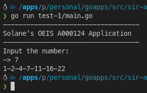

## [ Test-1 ] A Solane's OEIS A000124 Application
Run the application: 
```
    go run main.go
```
When the app started, you'll be prompted to input the number you want to calculate.

The input number will then be calculated using **solaneA000124** function. For example, if you input **7** the output of the app will be:
```
    1-2-4-7-11-16-22
```

You can also build the docker image by running this command:
```
    docker build -t test-1:latest -f Dockerfile .
```

Then you can run the app via docker interactive command like this:
```
    docker run --rm -i test-1:latest
``` 
<p align="left">
    
</p>