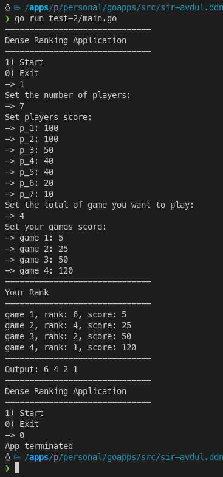

### [ Test-2 ] Dense Ranking Application
Run the application: 
```
    go run main.go
```

You can also build the docker image by running this command:
```
    docker build -t test-1:latest -f Dockerfile .
```

Then you can run the app via docker interactive command like this:
```
    docker run --rm -i test-1:latest
``` 

Follow all the prompted inputs that will appear in the terminal.
<p align="left">
    
</p>